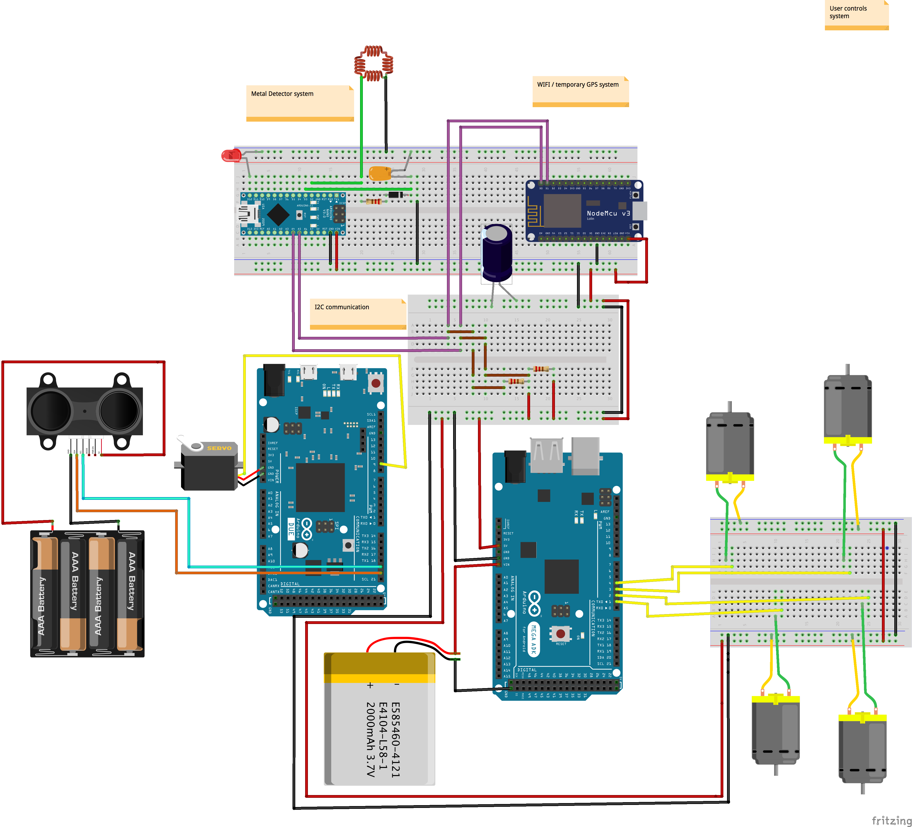

# Autonmous_metalDetector
//---------------------------------

A LIDAR enhanced metal detecting robot originally built to aid our military in finding underground mines out in the field. The robot uses GPS and WiFi connection to communicate with users through the interface. As the robot finds and detects metallic objects the UI pinpoints their location in real time, as well as the robots current location.

----------------------------------//

Below you'll find the pinLayout:

Microcontrollers used and their purpose:

Arduino DUE:

            Controller in charge of reading and processing data from the LIDAR sensor. 
            Notifies DRIVER controller (MEGA) which route to take.
            
Arduino MEGA: 

            Robot Driver that constantly listened to DUE (LIDAR reader / processor) for direction.
            
Arduino NANO:

            Metal Dectector system
            Notifies WIFI module when metal is detected. 

ESP32:      

            Wifi Module that sends coordinates to server when notified from the metal detector (NANO)
            Also used as a temporary GPS system 
